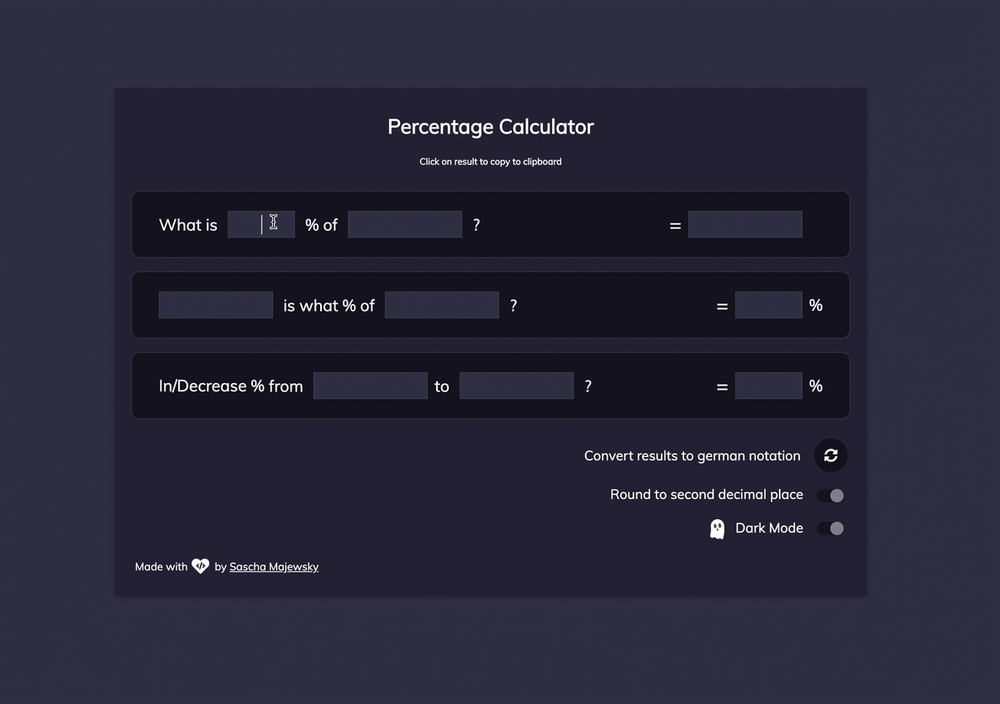

# percentage-calculator

A web-based percentage calculator for daily use at my workplace written in plain vanilla Javascript, HTML and CSS.

[Visit Live](https://www.percent.saschamajewsky.de)

## Features

- Automatic Calculation -> no "calculate" clicks required
- Copy results to clipboard automatically by clicking on it
- German notations are weird -> convert results on button click
- Dark Mode 👻 and Light Mode :book: themes available as preference
- Delete inputs by clicking on them for convenience and longer lasting delete keys
- Rounding mode to second decimals place as preference
- Preferences are persisted in LocalStorages and loaded on startup
- Dare to hover over ghosts
